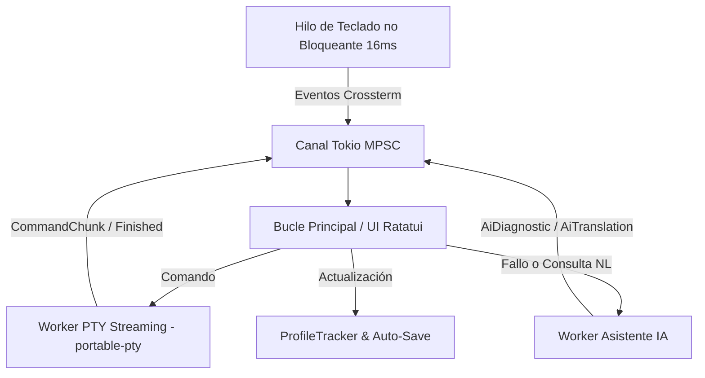

# ⚡ Warpi (Warp Rust CLI)

> **Terminal Inteligente por Bloques con Diagnóstico Autónomo, Streaming PTY y Telemetría de Habilidades en Rust.**

Warpi es una reinterpretación de la experiencia de terminal moderna (estilo Warp) construida completamente en **Rust**, impulsada por un bucle de eventos asíncrono con **Tokio**, renderizado TUI mediante **Ratatui/Crossterm**, integración PTY nativa vía **portable-pty** y asistencia de Inteligencia Artificial de diagnóstico rápido y auto-remediación en una tecla.

---

## 🚀 Características Principales

- **Bloques Atómicos de Comandos**: Cada instrucción ejecutada se aísla con su marca de tiempo, estado (`⏳ Pending`, `🔄 Running`, `✅ Success`, `❌ Error`), salida y diagnóstico.
- **Streaming de Salida en Tiempo Real**: Visualización reactiva e inmediata de los datos conforme el proceso secundario emite bytes a través del PTY nativo (`/bin/zsh` o tu `$SHELL`).
- **Diagnóstico y Auto-Remediación Autónomos**:
  - Al fallar un comando, la IA analiza el error en segundo plano y genera la solución exacta.
  - Presiona **`[Tab]`** para autocompletar la solución en la barra de comandos al instante.
- **Traducción de Lenguaje Natural**:
  - Presiona **`[Ctrl+A]`** para cambiar al modo IA y escribir solicitudes como *"ver puertos en uso"* o *"buscar archivos grandes"*.
- **Compatibilidad Multi-Proveedor IA**:
  - Soporte para **Google Gemini** (`GEMINI_API_KEY`).
  - Soporte para **OpenAI** (`OPENAI_API_KEY`).
  - **Motor Inteligente Offline Integrado**: Funciona sin internet ni API keys resolviendo errores típicos de permisos (`sudo`), ejecutables no instalados (`brew`), branches remotas de Git, puertos ocupados, etc.
- **Telemetría y Nivel de Habilidades**:
  - Registro automático de comandos ejecutados, tasa de éxito manual vs. asistencia de IA agrupado por herramienta (`git`, `cargo`, `docker`, etc.).
  - Persistencia automática de progreso en `~/.warp_profile.json`.
- **Historial y Scroll Integrados**:
  - Navegación de historial con **`[↑]`** y **`[↓]`**.
  - Scroll vertical con **`[PageUp]`** y **`[PageDown]`**.

---

## ⌨️ Atajos de Teclado

| Atajo | Acción |
|---|---|
| `[Enter]` | Ejecutar el comando ingresado |
| `[Ctrl + A]` | Alternar Modo Terminal ↔ Modo Asistente IA |
| `[Tab]` | Cargar solución sugerida por la IA (Auto-Fix) |
| `[↑]` / `[↓]` | Navegar historial de comandos |
| `[PgUp]` / `[PgDn]` | Scroll en bloques de salida |
| `[Esc]` o `[Ctrl + C]` | Salir limpiamente de la terminal |

---

## 🛠️ Requisitos e Instalación

### Prerrequisitos
- **Rust & Cargo** (Edición 2024 o 2021)
- Sistema operativo macOS o Linux con soporte PTY

### Compilar y Ejecutar

```bash
# Clonar el repositorio
git clone https://github.com/Blackmvmba88/warpi.git
cd warpi

# Ejecutar pruebas unitarias
cargo test

# Iniciar la terminal inteligente
cargo run
```

### Opcional: Configurar Claves de IA
Para habilitar razonamiento con modelos en la nube (si no se configuran, el motor offline se activa por defecto):
```bash
# Para Google Gemini:
export GEMINI_API_KEY="tu_clave_de_gemini"

# O para OpenAI:
export OPENAI_API_KEY="tu_clave_de_openai"

cargo run
```

---

## 🏗️ Arquitectura Técnica



---

## 📄 Licencia

MIT License. Creado con fines de innovación y productividad en terminales modernas.
